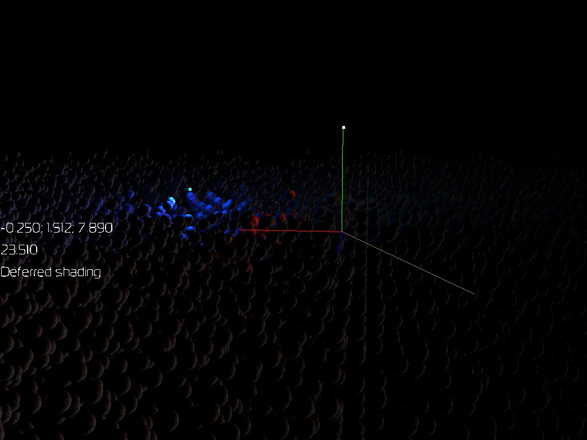

New Exprience Engine

[](https://github.com/Lemiort/NEE/actions/workflows/build.yaml)

# README #
This is realization of Openg3.3+ graphics engine. Adapted to conan2





# Building

Use following command to configure cmake before building

```bash
conan install . --output-folder=build --build=missing -s compiler.cppstd=23
```
